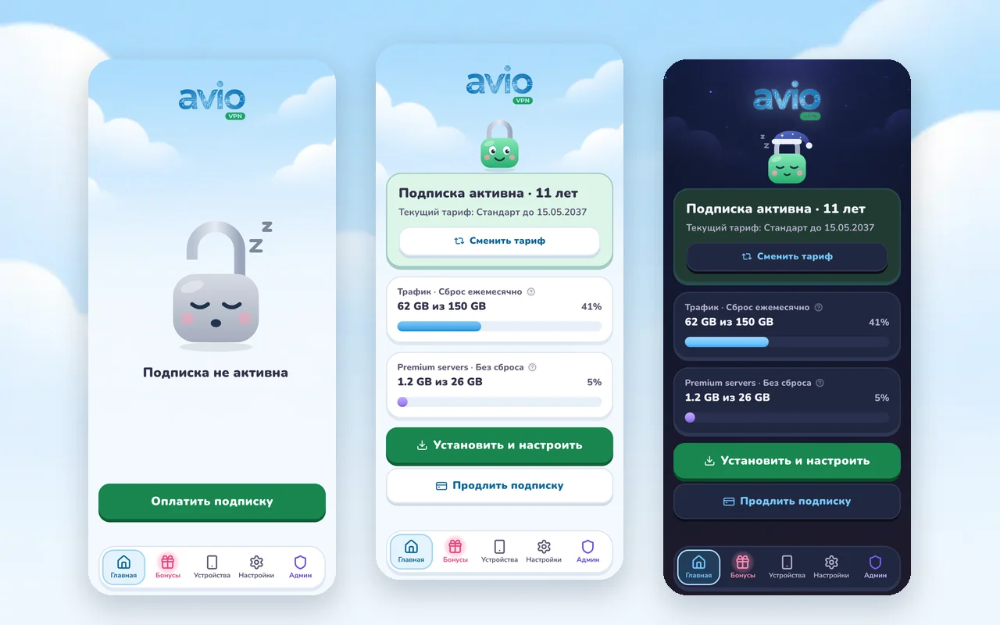
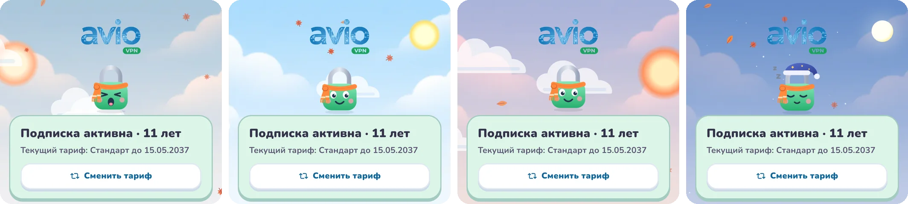
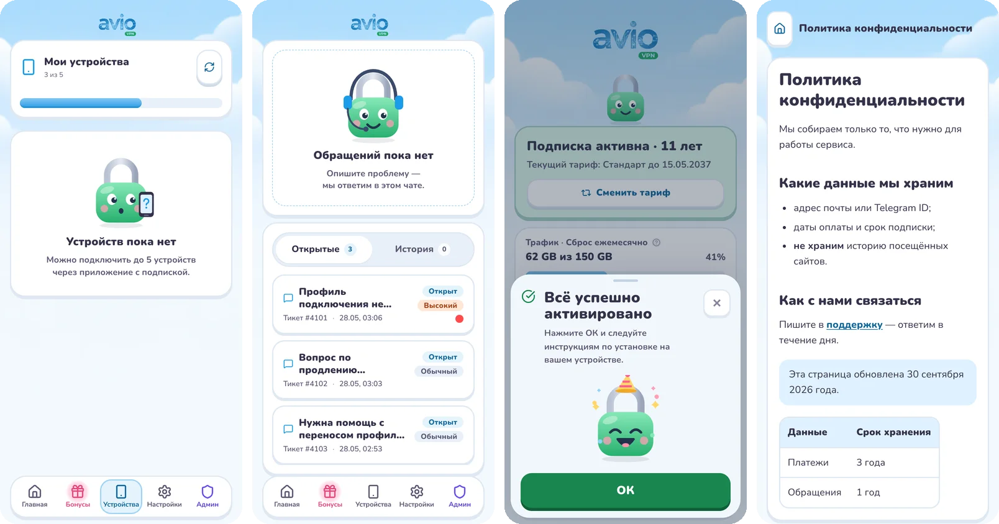
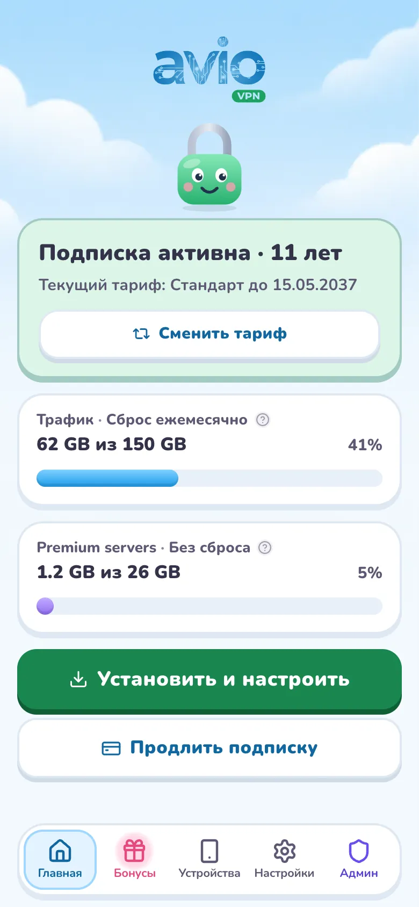
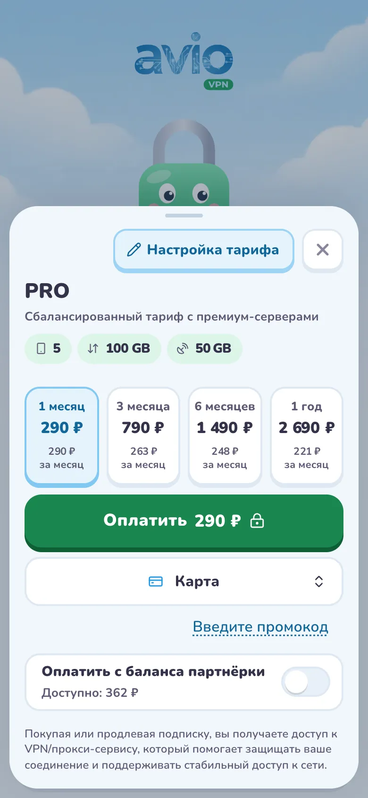
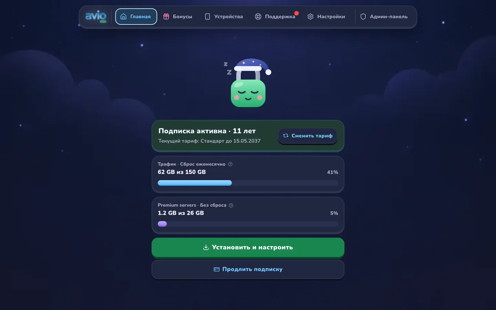
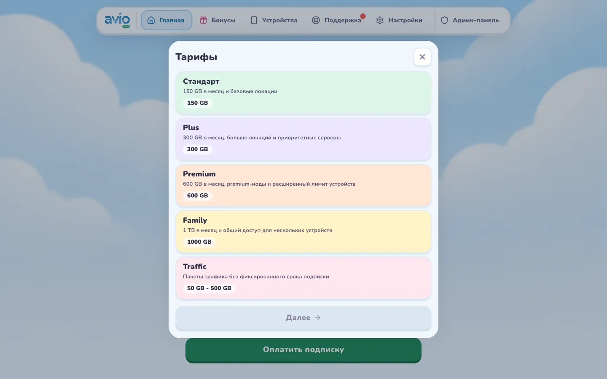

# Avio Soft — Your internet

A theme for [remnawave-minishop](https://gitlab.com/3252a8/remnawave-minishop), built from scratch
on top of Core's markup. The logo comes from your bot's brand settings.

[Русский](README.md)

## The idea

A friendly VPN that tells you honestly whether you are protected. The mascot is a padlock:

- without a subscription it is open and asleep;
- with one it is shut and happy;
- when the subscription is about to end it worries and the card turns yellow; it also worries once 90% of the traffic is spent;
- when the traffic is gone, the card turns pink with a red bar.

The lock lives on the home screen (in the free space between the logo and the status card,
up to 176 px; it shrinks on short windows and steps aside below 56 px), on Devices without a
subscription, on the sign-in screen and on empty screens. It moves: it wakes up when home opens,
blinks and hops by day, dozes in a nightcap at night and sometimes peeks with one eye. Motion is
CSS over static SVG (Core does not allow animation inside SVG) and stops with "reduce motion".

The sky is a painting with clouds, a night sky in dark mode; both were generated with Codex in
the theme's palette and sit still under the interface.

## Time of day and seasons

Since 2.5.0 the package carries a theme effect, `effects/main.js` (package format v2, Core 3.8.0
or newer). It reads the local time and date and hands them to the stylesheet:

- **Morning** (5–10): a rosy sky, the sun rising on the left, the lock yawns and stretches.
- **Day** (10–18): the sun in the corner, the lock is lively — it blinks and hops.
- **Evening** (18–22): sunset, pink clouds, the sun going down on the right, a calm lock.
- **Night** (22–5): the sky darkens, the moon comes out, the lock dozes in a nightcap.

Seasons dress the lock and fill the sky:
- winter: a beanie, a scarf and snow;
- spring: a daisy and petals;
- summer: sunglasses by day, fireflies at night;
- autumn: an orange scarf and leaves.

Holidays:
- New Year (December 20 — January 10): a Santa hat and snow;
- Halloween (October 29 — November 1): a witch hat, a pumpkin and bats;
- February 14: a heart balloon and floating hearts.

In dark mode stars always twinkle and a shooting star crosses now and then. Clouds drift across
the day sky, and the lock's eyes follow your finger or cursor.

How it is switched on:
- The effect is JavaScript, so Core runs it only with a separate administrator permission
  (a checkbox on install and on every update, and the JavaScript button on the theme card).
- Core never runs theme effects for administrators, except in the theme preview from the admin panel.
- Without the effect the theme is complete: the night sky means night (the lock dozes), the day sky means day, no seasons.
- Visitors can turn effects off with "Turn off theme effects" at the bottom of Settings, or with `?theme_effects=off`.
- With "reduce motion" the effect does not start.
- Preview any moment with URL parameters: `?avio_daypart=night&avio_season=winter&avio_holiday=newyear`
  (`morning`, `day`, `evening`, `night`; `winter`, `spring`, `summer`, `autumn`; `newyear`, `halloween`, `valentine`, `none`).

## What's inside

**Checkout.**
- The payment step header is one line: back on the left, "Plan settings" and close on the right.
  Below: the plan name, its description in small print and the limits as chips.
- Periods always sit in one row; tile prices are whole rubles (the exact sum is on the Pay button)
  and scale with the tile, so a five-digit price fits even at 320 px.
- The promo code is a link right under the payment method; the field opens on tap.
- "Pay" comes right after the period and sticks to the bottom; the payment method, promo code
  and balance sit under it (the owner's choice).
- The payment step fits without scrolling on a 390 × 844 phone and in a 425 × 520 Telegram Desktop window.
- Traffic top-ups: the home buttons take their bar's colour, and "top-up traffic never expires"
  is shown large on a green plate with ∞.

**Screens.**
- One family of cards: a 2 px edge, a floor underneath, buttons that sink when pressed.
- Settings in three groups with "Log out" apart; on Bonuses, "Invite a friend" comes first.
- Empty screens show the lock in a fitting pose: with a phone (no devices), a headset (no tickets),
  a gift (no partner clients), a key (no passkeys), a magnifier (no instructions).
- "Everything is activated" shows a party lock with confetti.
- The traffic bar turns amber after 80% and red after 95%.
- Toasts are white plates with a floor, loading placeholders shimmer in sky colours.
- Information pages (Markdown from the admin panel) follow the theme; account merging uses the same code cells.

**Desktop.** A floating bar at the top replaces the left column: logo, sections with labels, admin entry.
Content is a centred column up to 760 px.

**Accessibility.** Small text at 5:1 or better on every background, white on the green button at 4.6:1;
tab labels 11 px, inputs 16 px so iPhone does not zoom; touch targets from 44 px; a focus ring everywhere;
"reduce motion" is respected.

## Screenshots

Taken on a Core demo build: phone 390 × 844, desktop 1440 × 900. The full set is in the
[Russian README](README.md#скриншоты).

| | |
| --- | --- |
|  |  |
|  |  |

## Installation

1. **Admin → Appearance → Add themes**: upload `avio-soft-theme.zip` from the
   [releases](https://github.com/drobyazkome/avio-soft-minishop-theme/releases) or point to this
   repository (`https://github.com/drobyazkome/avio-soft-minishop-theme`, branch `main`).
   Tick the JavaScript permission to get the time of day and seasons.
2. Open the preview of **Avio Soft — Your internet** and press **Activate**.
3. The theme uses your bot's logo from the brand settings; it ships none of its own.

## Customising

The sky blue for choices (`--s-pick`) follows the theme's accent token: change the accent in
**Admin → Appearance** and selected tiles, links, focus rings and bars follow, with light and dark
shades derived by the theme. Other colours are `--s-*` variables at the top of `style.css`:
button green `--s-go`, pastel tariff tones `--s-mint`, `--s-lilac`, `--s-peach`, `--s-butter`,
`--s-rose`, attention `--s-amber`. The background painting is `--s-sky-art`; the lock's frames are
`--s-f-happy`, `--s-f-doze`, `--s-f-worry` and others in the 2.5.0 block.

Nunito ships in the package. The font tokens name a system stack so Core does not ask Google Fonts
for a family that only exists here; Nunito is applied through `--font-sans` and `--font-logo`.

## Contents

- `theme.json` — palettes, radii, `light` and `dark` variants.
- `style.css` — styles for minishop's existing markup.
- `effects/main.js` — the theme effect: time of day, season, holiday, eyes following the cursor, particles. No build step, no dependencies.
- `images/bg-light-sky.webp`, `images/bg-dark-night.webp` — backgrounds generated with Codex.
- `images/lock-*.svg` — the mascot: frames, pupils as a separate layer and poses for empty screens.
- `images/acc-*.svg` — seasonal accessories drawn in the lock's own 160 × 172 grid.
- `images/fx-*.svg` — a snowflake, leaves, a petal, a heart, a bat and a cloud for the sky.
- `images/arrow-*.svg`, `images/infinity.svg`, `images/user.svg` — install arrows, the ∞ sign, the fallback avatar.
- `fonts/Nunito.woff2`, `fonts/Nunito-OFL.txt` — Nunito under SIL OFL 1.1, Latin and Cyrillic.
- `preview.webp` — the theme card; `screenshots/` stay in the repository and are not installed.

No external CSS and no Google Fonts requests. The only JavaScript is `effects/main.js`, and it runs
only with the administrator's permission.

## Compatibility

`theme_api: 1`, package format v2 — Core 3.8.0 or newer. For older Core use release
[v2.4.6](https://github.com/drobyazkome/avio-soft-minishop-theme/releases/tag/v2.4.6).
Every commit is checked by Core's package validator in GitHub Actions; a tag builds a release with the zip.
