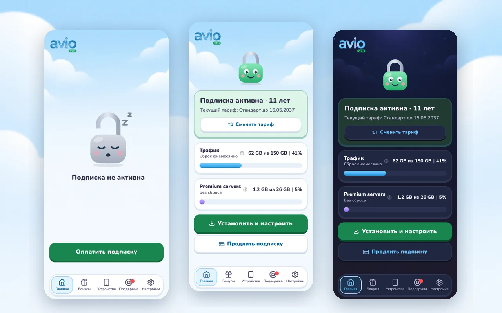
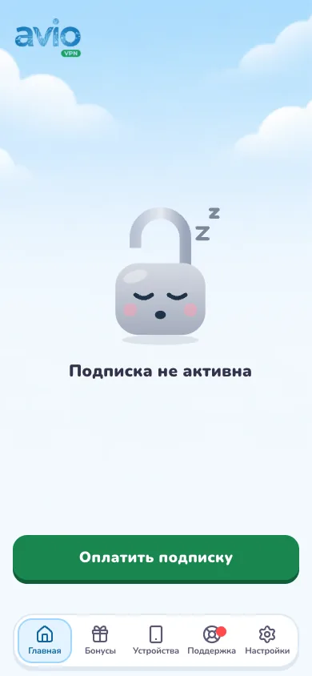
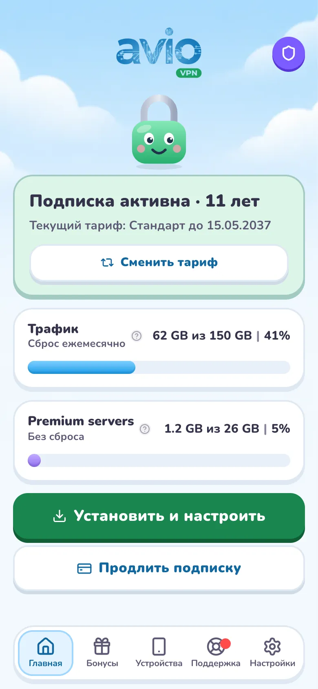
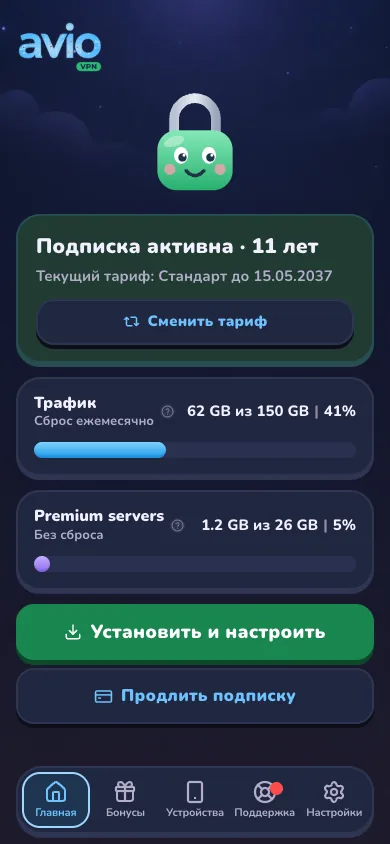
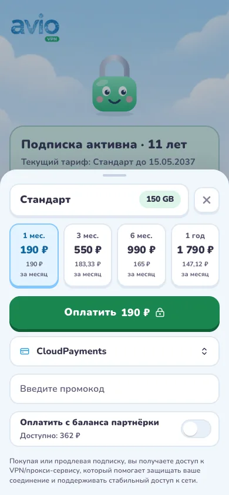
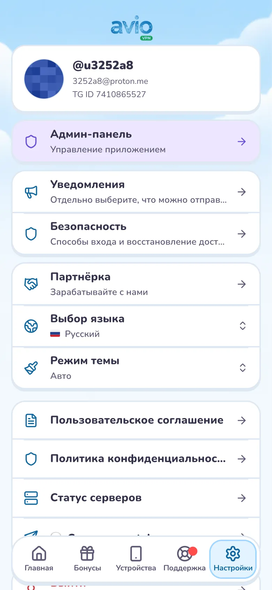
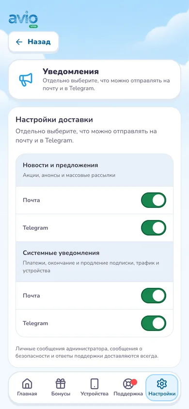
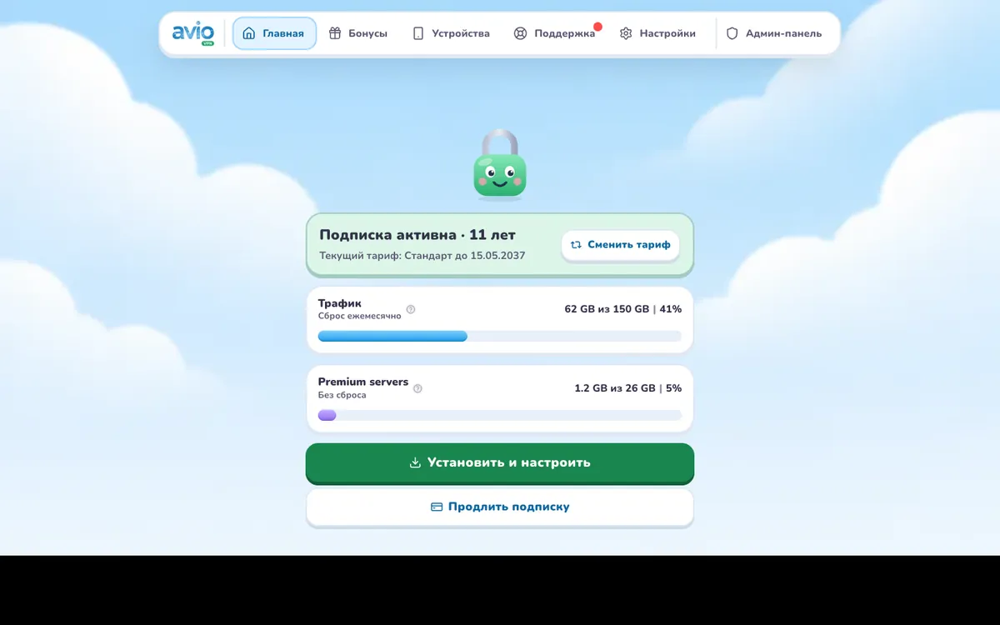
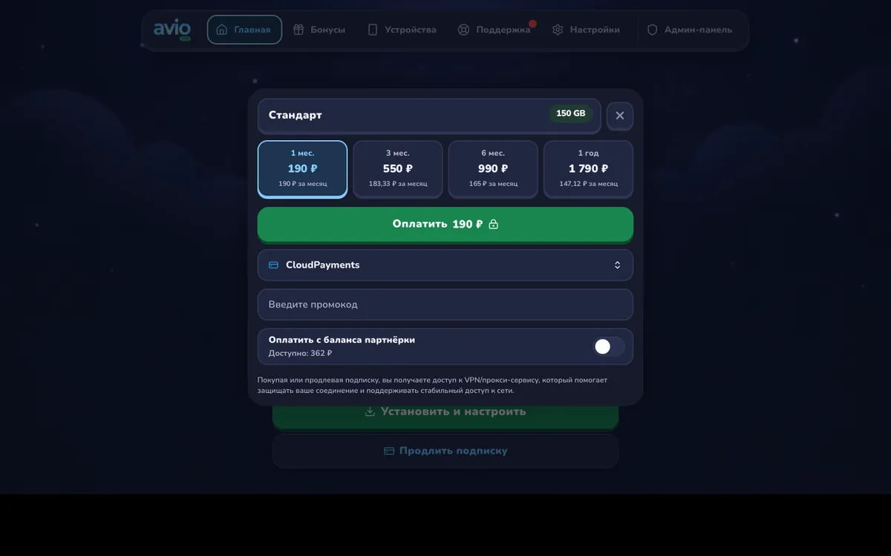

# Avio Мягкий — Твой интернет

Тема для [remnawave-minishop](https://gitlab.com/3252a8/remnawave-minishop), собранная с нуля
поверх разметки Core. От прежних версий Avio остался только логотип, перекрашенный в цвета схемы.

## Идея

Дружелюбный VPN, который честно показывает, защищён ли ты. Персонаж — замок:

- без подписки он открыт и спит;
- с подпиской закрыт и радуется;
- когда подписка кончается, тревожится, а карточка становится жёлтой;
- если кончился трафик, карточка розовая с красной полосой.

Замок живёт на главной (занимает свободное место между логотипом и статусом, от 96 до 176 px),
в «Устройствах» без подписки и на экране входа. Он двигается: весёлый покачивается и моргает,
спящий дышит и «храпит», встревоженный вздрагивает. Движение — CSS поверх статичных SVG
(Core не пускает анимацию внутрь SVG) и выключается при «уменьшить движение».

У администраторов на главной телефона есть кнопка «Админ-панель» справа от логотипа.

Установка — путь по шагам с номерами: устройство, приложение, установка, подписка, подключение.

Фон — небо с облаками, в тёмном режиме ночное небо со звёздами. Обе картинки сгенерированы
Codex по палитре темы и лежат неподвижным слоем под интерфейсом.

## Что внутри

**Покупка.**
- Выбранный тариф — строка-заголовок шторки: название, лимиты плашками («📱 3 · ⇅ Безлимит · 15 GB»),
  карандаш «изменить» и крестик. Без отдельной коробки нечему съезжать относительно сроков.
- Промокод — текстовая ссылка в самом низу; поле раскрывается по нажатию.
- Цена за месяц в плитках сроков всегда в две строки, плитки читаются одинаково.
- Все окна на телефоне — шторки снизу, на компьютере — окна по центру.
- Шаг оплаты помещается в экран без прокрутки (553 px вместо 816 px на 390×844).
- Шапка шага оплаты — одна строка: «назад», тариф с объёмом трафика, «закрыть».
- Описание сервиса из админки не удалено, оно стало сноской внизу.
- Сроки стоят в один ряд, на экранах уже 360 px — сеткой 2 × 2.
- «Оплатить» идёт сразу после срока и прилипает к низу. Способ оплаты, промокод и баланс — под кнопкой, это решение владельца.
- Баланс партнёрки включается переключателем.

**Тарифы.** Пастельные карточки, у каждого тарифа свой тон, голубой означает только «выбрано».
Тон зависит от порядка тарифа в админке, а не от названия.

**Экраны.**
- Одна порода карточек: рамка 2 px, «пол» снизу, кнопки вдавливаются при нажатии.
- Настройки — три группы, «Выйти» отдельно. На «Бонусах» первым идёт «Пригласить друга».
- Иконки приложений видны в светлом режиме.

**Компьютер.** Вместо колонки слева — плавающая панель сверху по центру: логотип, разделы
с подписями, вход в админку. Контент стоит по центру колонкой до 760 px. Подразделы настроек
убраны из меню — они есть на экране «Настройки». Планшеты и телефоны остаются с нижним меню.

**Доступность.**
- Мелкий текст не ниже 5:1 на всех фонах, белый на зелёной кнопке — 4,6:1.
- Подписи меню 11 px, поля ввода 16 px, чтобы iPhone не приближал страницу.
- Зоны нажатия от 44 px. Исключение — кнопки форматирования в чате, 40 px.
- Рамка фокуса у всех элементов, учёт настройки «уменьшить движение».

## Скриншоты

| Нет подписки | С подпиской | Тёмный режим |
| --- | --- | --- |
|  |  |  |

| Оплата | Настройки | Уведомления |
| --- | --- | --- |
|  |  |  |

| Компьютер | Оплата на компьютере, тёмный режим |
| --- | --- |
|  |  |

## Установка

1. **Админка → Внешний вид → Добавить темы**, загрузите `avio-soft-theme.zip` или
   укажите этот репозиторий с веткой `avio-soft`.
2. Откройте предпросмотр **Avio Мягкий — Твой интернет** и нажмите **Активировать**.
   Прежние версии Avio остаются в библиотеке для отката.
3. Логотип тема подставляет сама (`images/logo-sky-*.webp`, светлый и тёмный), логотип
   из настроек бренда на экранах мини-приложения не показывается.

## Настройка

Цвета темы — переменные `--s-*` в начале `style.css`: зелёный кнопки `--s-go`, голубой
выбора `--s-pick`, пастельные тона тарифов `--s-mint`, `--s-lilac`, `--s-peach`,
`--s-butter`, `--s-rose`, «внимание» `--s-amber`. Картинка фона — `--s-sky-art`, персонаж —
`--s-hero-sleep`, `--s-hero-happy`, `--s-hero-worry`.

Шрифт Nunito идёт в пакете. В токенах темы указан системный шрифт, чтобы Core не
запрашивал у Google Fonts семейство, которого там нет. Nunito подставляется
переменными `--font-sans` и `--font-logo` в стилях.

## Состав

- `theme.json` — палитры, радиусы, варианты `light` и `dark`.
- `style.css` — оформление существующей разметки minishop.
- `images/bg-light-sky.webp`, `images/bg-dark-night.webp` — фоны, сгенерированы Codex.
- `images/lock-*.svg` — персонаж, авторский SVG: спит, радуется, тревожится и кадры для моргания и «храпа».
- `images/logo-sky-light.webp`, `logo-sky-dark.webp` — логотип Avio в цветах схемы.
- `fonts/Nunito.woff2`, `fonts/Nunito-OFL.txt` — Nunito под SIL OFL 1.1, латиница и кириллица.
- `preview.webp` — карточка темы 1280×800, `screenshots/` — снимки для этого описания.

Внешних CSS, запросов к Google Fonts и исполняемого кода в пакете нет.

## Совместимость и проверка

`theme_api: 1`, Core dev от 24.09.2026 (`3312136`), нужна проверка SVG в пакетах.

Версия 2.1.0 проверена на demo-сборке Core dev в Chromium:
- главная (активная, истекающая, без подписки, с закончившимся трафиком, со статусом серверов);
- оплата с дополнениями и без, смена тарифа;
- установка, бонусы, устройства, поддержка, настройки, вход;
- все окна: новое обращение, переписка, отключение устройства, подарок, уведомления, безопасность, партнёрка, меню языка, темы, платформы и способа оплаты.

Проверены оба режима на ширине 320, 390 и 1440 px, панель сверху проверена на 1024 px.
Горизонтальной прокрутки, битых картинок и ошибок JavaScript нет.

Проверки скилами:
- `impeccable` critique: дизайн-разбор и детектор;
- чек-листы `mobile-native` и `web-design-guidelines`;
- `ui-ux-pro-max` (правила про промокод и сводку), `interface-design` (сводка тарифа),
  `design-critique` (проверка оплаты, главной и установки).

Demo заменяет API демонстрационными данными: реальные платежи и авторизация этой
проверкой не покрываются.
